# SmartPack Frontend Documentation

SmartPack is a Flutter mobile application that helps users plan trips and generate personalized packing lists. The frontend communicates with the SmartPack Django REST backend, uses device services such as location and camera access and presents the travel workflow through a custom mobile UI.

## Application Purpose

The goal of SmartPack is to make travel preparation easier. A user can register, log in, create a trip, use their current location as the destination, and receive a smart packing list based on trip details, weather data, luggage type and trip type.

Main user actions:

- Create an account and log in.
- View the home dashboard with upcoming and previous trips.
- Create a new trip with destination, dates, luggage type and trip type.
- Use the phone location to fill the destination field.
- View a generated packing list grouped by category.
- Check packed items and change item quantities.
- Save or delete trip packing lists.
- View and edit profile information.
- Take and upload a profile photo with the camera.

## Technologies Used

- Flutter and Dart
- Provider for state management
- HTTP package for REST API communication
- Shared Preferences for local token storage
- Geolocator and Geocoding for location services
- Image Picker for camera access
- Google Fonts for custom typography
- Material Design widgets and custom reusable widgets

## Project Structure

```text
frontend/
|-- lib/
|   |-- main.dart
|   |-- api_config.dart
|   |-- models/
|   |-- providers/
|   |-- screens/
|   |-- services/
|   `-- widgets/
|-- assets/
|-- android/
|-- ios/
|-- docs/
|   `-- screenshots/
|-- test/
|-- pubspec.yaml
`-- README.md
```

Important folders:

- `screens/` contains the application screens such as welcome, login, register, home, create trip, trips list, packing list and profile.
- `providers/` contains Provider classes for authentication, profile data and trips.
- `services/` contains API and device-service logic.
- `models/` contains Dart data models used to parse backend JSON responses.
- `widgets/` contains reusable UI components such as buttons, text fields, logo, trip cards and packing list sections.

## Setup and Running

### Prerequisites

- Flutter SDK
- Dart SDK
- Android Studio with Android Emulator or a real Android device
- Running SmartPack Django backend

### Install Flutter Dependencies

From the `frontend/` directory:

```bash
flutter pub get
```

### Run the Backend

From the `backend/` directory:

```bash
python manage.py runserver
```

For a physical phone on the same Wi-Fi network, run Django so it accepts connections from other devices:

```bash
python manage.py runserver 0.0.0.0:8000
```

### API URL Configuration

The API base URL is configured in:

```text
lib/api_config.dart
```

Current emulator configuration:

```dart
static const String baseUrl = 'http://10.0.2.2:8000';
```

Use the correct URL depending on where the app is running:

- Android Emulator: `http://10.0.2.2:8000`
- Physical phone: `http://127.0.0.1:8000`, and run Django with `python manage.py runserver 0.0.0.0:8000`

### Run the Flutter App

From the `frontend/` directory:

```bash
flutter run
```

Other useful commands:

```bash
flutter test
flutter clean
flutter build apk
```

## Backend Connection

The frontend communicates with the Django backend through REST endpoints defined in `ApiConfig`.

Used endpoint groups:

- Authentication: login, register, token handling
- Users: profile loading, profile update, profile photo upload
- Trips: create, list and delete trips
- Weather: weather data for a selected trip
- Packing: saved user packing lists
- ML/recommendation: generated packing recommendations

Authenticated requests include the JWT access token in the `Authorization` header:

```text
Authorization: Bearer <access_token>
```

Tokens are stored locally using `shared_preferences`.

## Demo Video

```text
https://www.youtube.com/shorts/ubjdY_qcMrg
```

The demo video shows the complete user flow: welcome screen, authentication, home dashboard, trip creation, location permission, generated packing list, profile editing, camera permission, profile photo update...

## State Management

The app uses Provider as the state management solution.

Providers used:

- `AuthProvider` manages login, registration state, logout, session checking, loading state and errors.
- `ProfileProvider` manages user profile loading, profile editing, profile photo upload, loading state and errors.
- `TripsProvider` manages trip loading, sorting, session cleanup, loading state and errors.

Providers are registered globally in `main.dart` using `MultiProvider`, which allows screens to access shared application state without manually passing data through constructors.

## Authentication

Authentication is implemented through:

- Register screen for creating a new account.
- Login screen for existing users.
- JWT access and refresh tokens returned from the backend.
- Local token persistence using `shared_preferences`.
- Authorization headers for protected API requests.
- Logout functionality that clears saved tokens and local session data.

The login flow redirects authenticated users to the home screen, while logout returns the user to the login screen.

## Custom UI Elements

The frontend includes reusable custom widgets and consistent styling.

Custom widgets include:

- `PrimaryButton`
- `AppTextField`
- `PasswordField`
- `AppLogo`
- `TripCard`
- `PackingItemTile`
- `PackingCategorySection`

The UI uses a consistent color palette, rounded cards, icons, custom typography with Google Fonts, loading states, empty states, dialogs, bottom sheets, dropdowns, and progress indicators.

## Web Services

The app uses the `http` package to communicate with the backend REST API.

Examples of web-service usage:

- User login and registration
- Profile loading and updating
- Trip creation, retrieval and deletion
- Weather retrieval for trips
- Packing recommendation retrieval
- Saving user packing lists
- Uploading profile photos with multipart requests

The API communication is separated into service classes, which keeps the screens cleaner and makes the code easier to maintain.

Weather integration is handled through the backend. The Flutter app does not call the external Weather API directly. Instead, the app sends trip information to the Django REST backend, and the backend retrieves weather data from the Weather API. The frontend then displays the weather snapshot and uses the returned recommendation data in the packing list screen.

## Location Services

Location services are implemented in `LocationService`.

The create trip screen includes a "Use my location" action. When tapped, the app:

1. Checks if location services are enabled.
2. Requests location permission if needed.
3. Gets the current GPS position.
4. Converts latitude and longitude into a readable location using geocoding.
5. Fills the destination field with the current location label.

Android permissions are declared in `android/app/src/main/AndroidManifest.xml`.

Location permissions:

- `ACCESS_FINE_LOCATION`
- `ACCESS_COARSE_LOCATION`
- `ACCESS_BACKGROUND_LOCATION`

## Camera Services

Camera access is implemented through the `image_picker` package.

On the profile screen, the user can tap the profile photo area to open the camera. After the user takes a picture, the app uploads it to the backend as a multipart profile update request.

Camera-related permission:

- `CAMERA`

Media/storage permissions are also declared for image access where required by Android versions.

## Data Handling

The frontend handles data through a clear model-service-provider structure.

Data models include:

- `AppUser`
- `Trip`
- `PackingItem`
- `PackingRecommendation`
- `TripPackingItem`
- `UserPackingList`
- `WeatherSnapshot`

Data handling examples:

- JSON responses are parsed into Dart model objects.
- Trips are sorted by creation date, start date or end date depending on the screen.
- Packing items are grouped by category on the packing list screen.
- Packed items can be checked and quantities can be increased or decreased.
- Saved packing lists are loaded before new recommendations, so user progress is preserved.
- Profile data is refreshed after editing or uploading a photo.
- Authentication tokens are stored locally and reused in protected requests.

## Navigation

Navigation is implemented with Flutter's `Navigator` and `MaterialPageRoute`.

Main navigation flow:

```text
Welcome Screen
|-- Login Screen
|   `-- Home Screen
|       |-- Create Trip Screen
|       |   `-- Packing List Screen
|       |-- Previous Trips Screen
|       |   `-- Packing List Screen
|       `-- Profile Screen
|           |-- Edit Profile Bottom Sheet
|           `-- Packing List Screen from recent trip
`-- Register Screen
    `-- Login Screen / Home Screen
```

The app also uses dialogs and modal bottom sheets:

- Delete trip confirmation dialog
- Edit profile bottom sheet
- Native Android permission dialogs for location and camera access


### User Action Walkthrough

The screenshots below follow the same order as a real user flow through the application.

#### 1. Welcome Screen

The user starts on the welcome screen and can choose to register or log in.

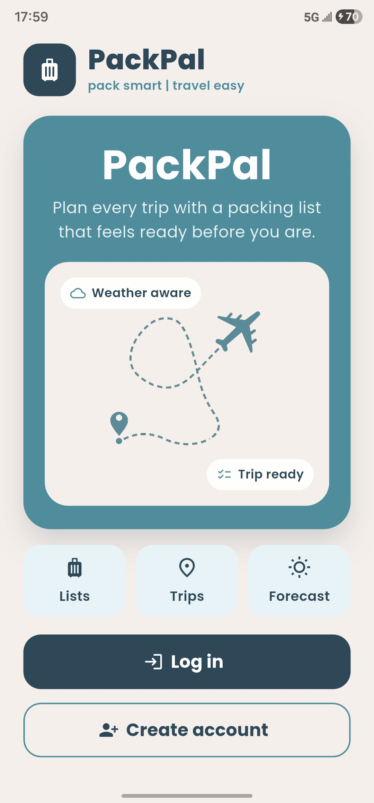

#### 2. Register Screen

A new user creates an account by entering account and profile information.

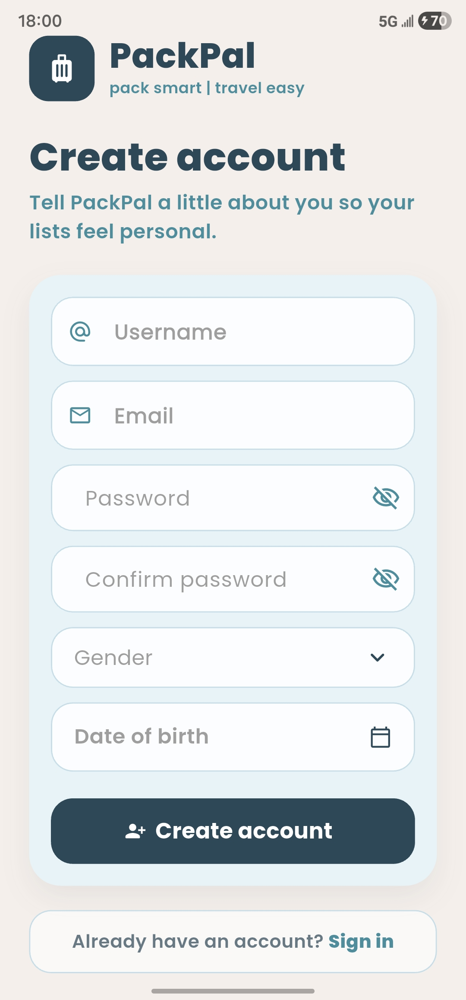

#### 3. Login Screen

An existing user signs in. After successful authentication, the JWT tokens are stored locally and used for protected requests.

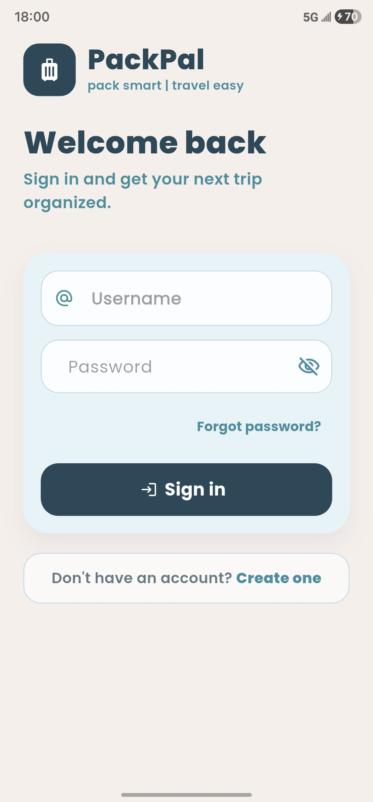

#### 4. Home Screen

The home screen works as the main dashboard. It shows the logged-in user, quick trip actions, upcoming trips, and access to previous trips and profile.

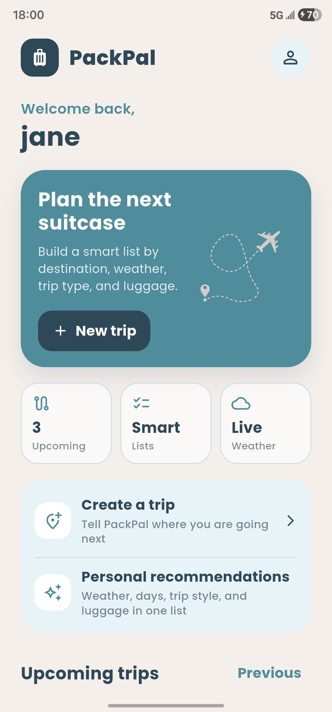

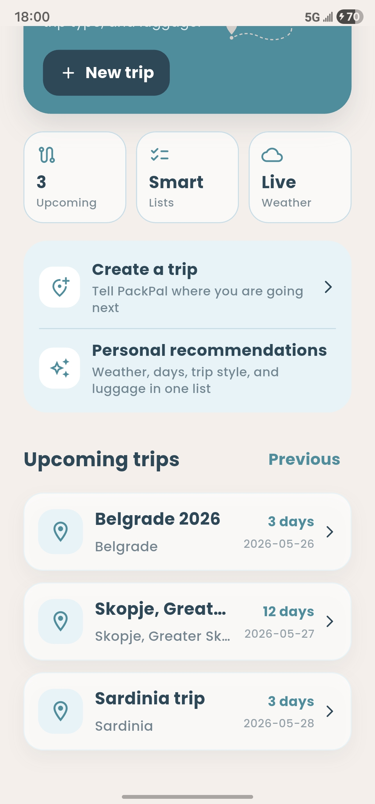

#### 5. Previous Trips

The previous trips screen lists trips whose return date has passed. These trips can be opened as saved packing-list previews.

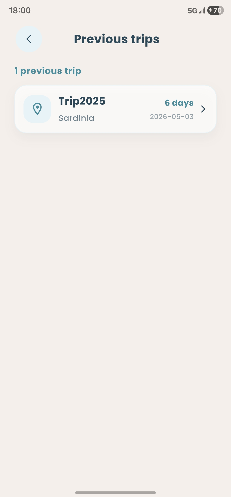

#### 6. Create Trip

The user enters trip details such as destination, trip name, departure date, return date, luggage type and trip type.

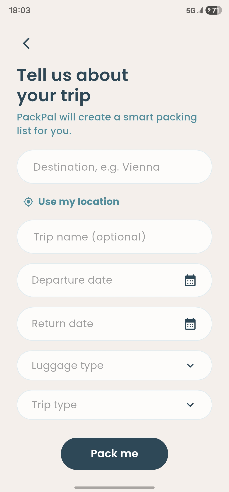

When the user taps "Use my location", Android asks for location permission.

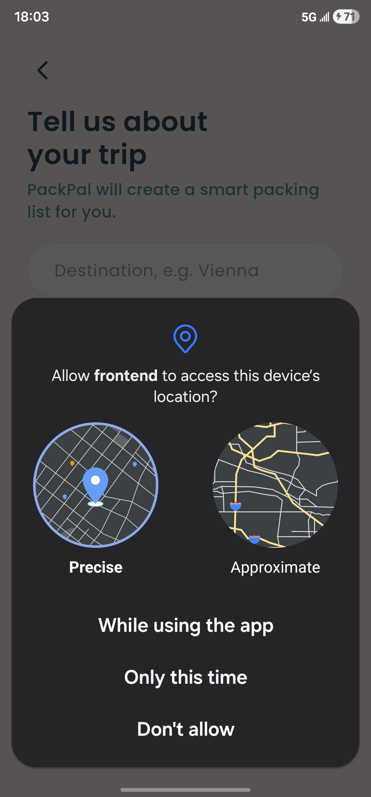

After permission is allowed, the destination field is populated using the current device location and reverse geocoding.

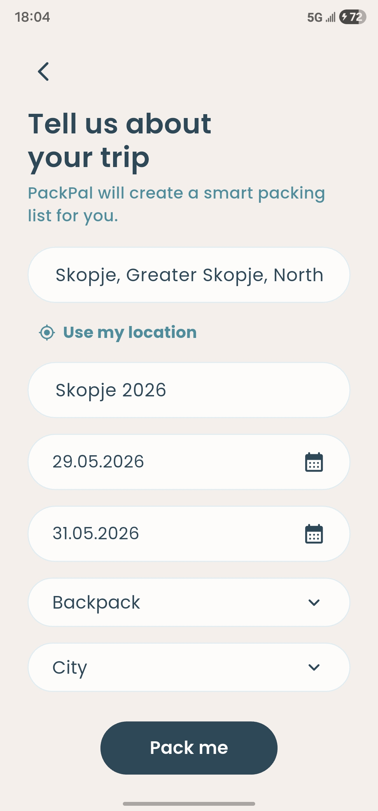

#### 7. Packing List

After creating a trip, the app opens the generated packing list. The top section shows trip information and weather data retrieved through the backend Weather API integration.

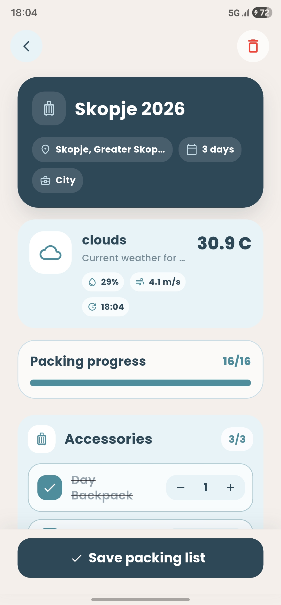

The packing list is grouped into categories and allows the user to check packed items and adjust quantities.

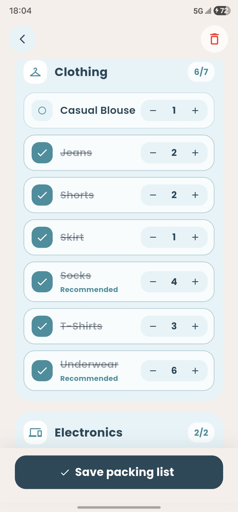

The user can save the packing list so the selected items and quantities are persisted.

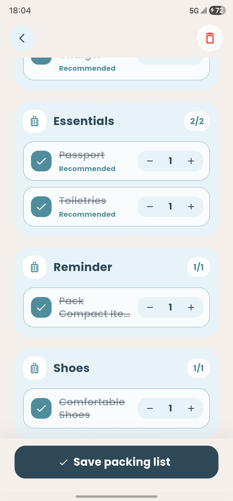

#### 8. Profile

The profile screen shows the user's account data, profile photo, trip statistics and recent trips.

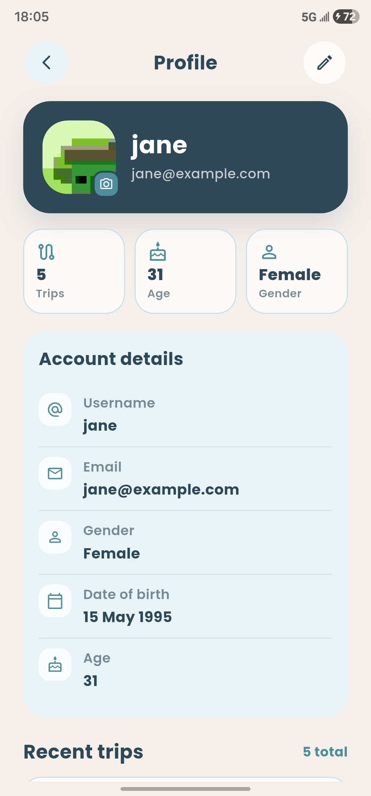

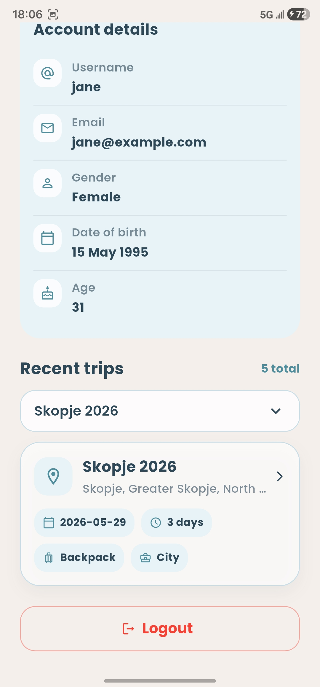

The recent trips dropdown lets the user select and open one of their trips from the profile screen.

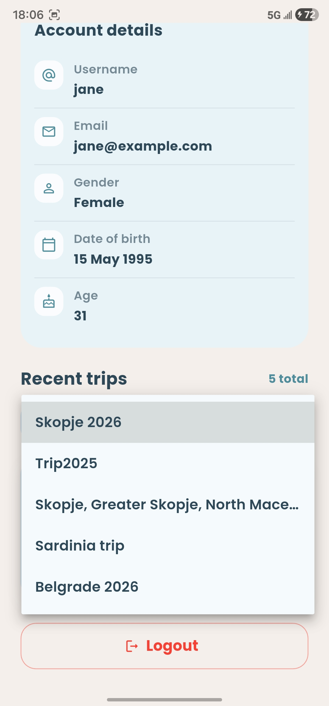

#### 9. Edit Profile

The edit profile bottom sheet allows the user to update profile information such as username, gender and date of birth.

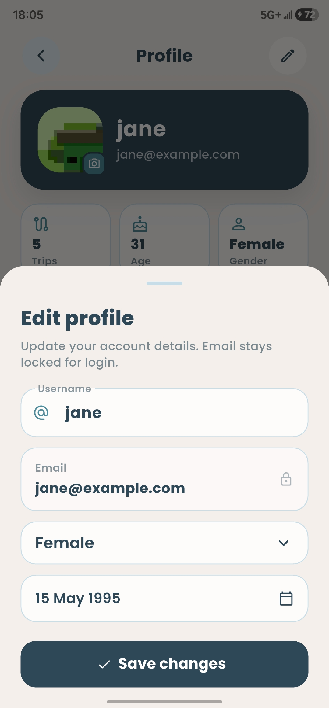

#### 10. Camera Permission and Profile Photo

When the user taps the profile photo area, Android asks for camera permission.

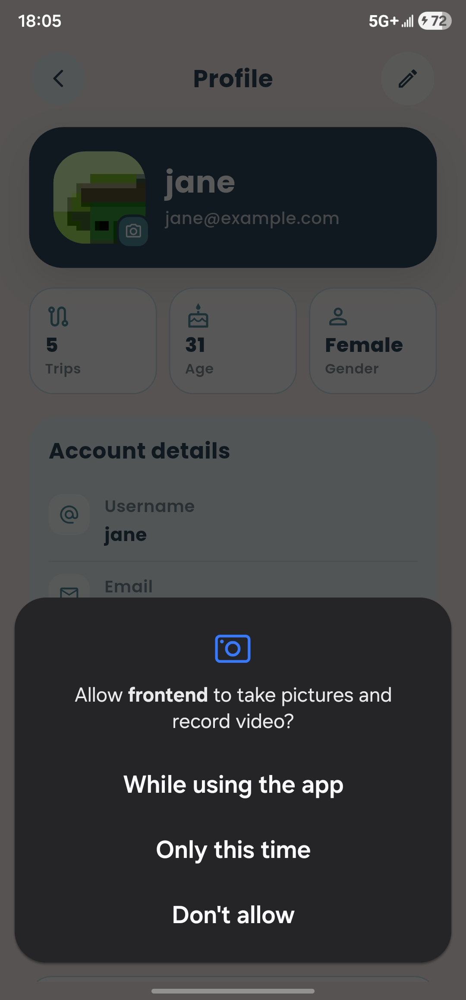

After taking a new photo, the app uploads it to the backend and displays the updated profile image.

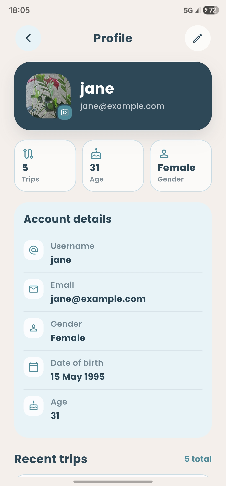

#### 11. Delete Trip Popup

From the packing list screen, the user can delete a trip. A confirmation popup prevents accidental deletion.

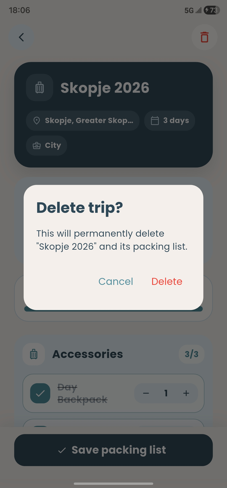


## Main User Workflow

1. The user opens the app on the welcome screen.
2. The user registers or logs in.
3. After successful authentication, the user reaches the home screen.
4. The user creates a new trip.
5. The user can type a destination manually or use the current location.
6. The user selects dates, luggage type and trip type.
7. The app sends the trip to the backend.
8. The backend returns trip-related data, weather data and recommendations.
9. The user views the generated packing list.
10. The user checks packed items, changes quantities and saves the list.
11. The user can later view previous trips or open recent trips from the profile screen.
12. The user can edit profile details or take a new profile photo.

## Android Permissions

Declared permissions:

```text
<uses-permission android:name="android.permission.ACCESS_FINE_LOCATION"/>
<uses-permission android:name="android.permission.ACCESS_COARSE_LOCATION"/>
<uses-permission android:name="android.permission.ACCESS_BACKGROUND_LOCATION"/>
<uses-permission android:name="android.permission.READ_MEDIA_IMAGES"/>
<uses-permission android:name="android.permission.READ_EXTERNAL_STORAGE" android:maxSdkVersion="32"/>
<uses-permission android:name="android.permission.WRITE_EXTERNAL_STORAGE" android:maxSdkVersion="32"/>
<uses-permission android:name="android.permission.CAMERA"/>
```

These permissions support the location and camera requirements of the application.

## Summary

SmartPack is an intelligent travel companion that goes beyond traditional packing checklists. By combining user preferences, trip details, weather forecasts, location services and AI-driven recommendations, the application helps travelers create personalized packing plans with minimal effort. Built with Flutter, SmartPack integrates secure authentication, RESTful web services, device capabilities and modern state management to deliver a seamless cross-platform mobile experience.

## Contributors
- Iva Spasovska 221032
- Maja Tankoska 221155
- Angela Tankoska 221105

